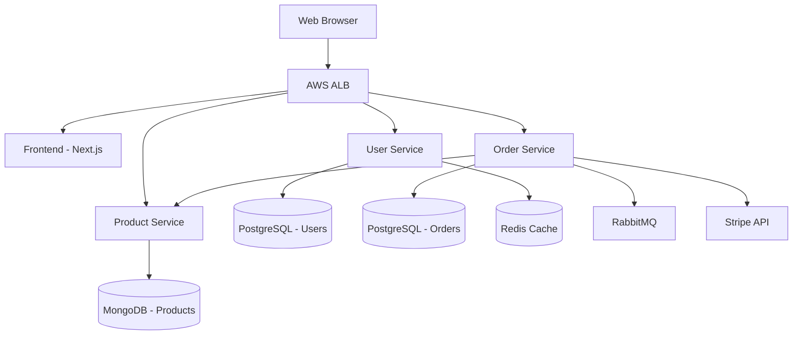

# E-Commerce Platform Architecture

## Overview

A microservices-based e-commerce platform designed to handle 10,000 requests per day with room for growth. The system follows a distributed architecture pattern with clear separation of concerns.

## System Context

The platform serves B2C customers looking to purchase products online. It integrates with external payment providers (Stripe) and shipping APIs. The system needs to support:
- User registration and authentication
- Product browsing and search
- Shopping cart management
- Order processing and payment
- Order tracking and fulfillment

## Components

### User Service

**Type:** Backend microservice
**Technology:** Node.js + Express
**Database:** PostgreSQL
**Purpose:** Handles user authentication, authorization, and profile management

**Responsibilities:**
- User registration and login
- JWT token generation and validation
- Profile CRUD operations
- Password reset flows

**Dependencies:**
- PostgreSQL for user data storage
- Redis for session caching

### Product Service

**Type:** Backend microservice
**Technology:** Python + FastAPI
**Database:** MongoDB
**Purpose:** Manages the product catalog

**Responsibilities:**
- Product CRUD operations
- Category management
- Product search and filtering
- Inventory tracking

**Dependencies:**
- MongoDB for flexible product schema
- Elasticsearch for product search (planned)

### Order Service

**Type:** Backend microservice
**Technology:** Node.js + Fastify
**Database:** PostgreSQL
**Purpose:** Processes orders and handles payments

**Responsibilities:**
- Order creation and tracking
- Payment processing via Stripe API
- Order status updates
- Email notifications

**Dependencies:**
- PostgreSQL for transactional data
- Stripe API for payments
- RabbitMQ for async notifications
- Email service (SendGrid)

### Frontend Application

**Type:** Web frontend
**Technology:** React + Next.js
**Purpose:** User-facing web application

**Responsibilities:**
- Product browsing UI
- Shopping cart
- Checkout flow
- User dashboard

**Dependencies:**
- User Service API
- Product Service API
- Order Service API

## Infrastructure Components

### Load Balancer
- **Technology:** AWS Application Load Balancer (ALB)
- **Purpose:** Distributes traffic across service instances
- **Configuration:** Round-robin with health checks

### Cache Layer
- **Technology:** Redis
- **Purpose:** Session storage, API response caching
- **Deployment:** Single instance (no clustering yet)

### Message Queue
- **Technology:** RabbitMQ
- **Purpose:** Async communication between services
- **Use cases:**
  - Order confirmation emails
  - Inventory updates
  - Notification dispatch

### Database
- **PostgreSQL:** Two instances (User Service, Order Service)
- **MongoDB:** One instance (Product Service)
- **Backup:** Daily snapshots to S3

## Deployment Architecture

**Container Runtime:** Docker
**Orchestration:** AWS ECS (Fargate)
**Networking:** VPC with public and private subnets
**Secrets:** AWS Secrets Manager
**Logging:** CloudWatch Logs
**Monitoring:** CloudWatch Metrics (basic)

## Cross-Cutting Concerns

### Authentication & Authorization
- JWT tokens issued by User Service
- Token validation at API Gateway level
- Role-based access control (RBAC) planned but not implemented

### Logging
- Application logs sent to CloudWatch
- No structured logging format currently
- No correlation IDs across services

### Monitoring
- Basic CloudWatch metrics (CPU, memory)
- No APM or distributed tracing
- No custom business metrics

### Error Handling
- HTTP error codes returned to clients
- No retry logic in service-to-service calls
- No circuit breakers implemented

### Resilience
- Health check endpoints on each service
- No rate limiting
- No bulkhead pattern
- No graceful degradation

## Data Flow

### Order Placement Flow

1. User selects products (Frontend → Product Service)
2. User proceeds to checkout (Frontend → Order Service)
3. Order Service validates inventory (Order Service → Product Service - sync HTTP)
4. Order Service processes payment (Order Service → Stripe API - sync HTTP)
5. Order Service creates order record (PostgreSQL transaction)
6. Order Service publishes order event (RabbitMQ)
7. Notification worker sends confirmation email (async)

## Known Limitations

1. **No database clustering** - PostgreSQL and MongoDB run as single instances
2. **No read replicas** - All reads hit primary databases
3. **No API Gateway** - Services exposed directly via ALB
4. **Limited monitoring** - Only basic infrastructure metrics
5. **No distributed tracing** - Hard to debug cross-service issues
6. **No automated scaling** - Manual ECS task count adjustments
7. **Single Redis instance** - No failover for cache/sessions

## Diagrams

### Component Diagram

## Future Enhancements

1. Implement API Gateway (AWS API Gateway or Kong)
2. Add distributed tracing (OpenTelemetry + Jaeger)
3. Set up database clustering and read replicas
4. Implement circuit breakers (using Hystrix or similar)
5. Add rate limiting and DDoS protection
6. Implement automated scaling based on metrics
7. Set up comprehensive monitoring dashboards
8. Add integration tests for critical flows
9. Implement blue-green deployment strategy
10. Set up disaster recovery plan
